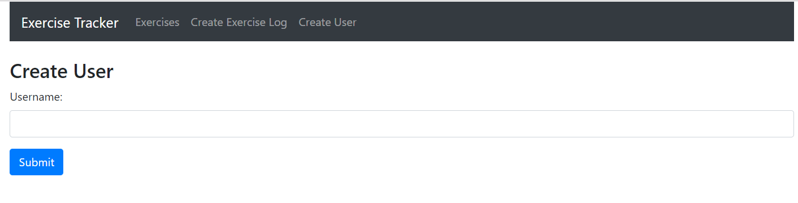
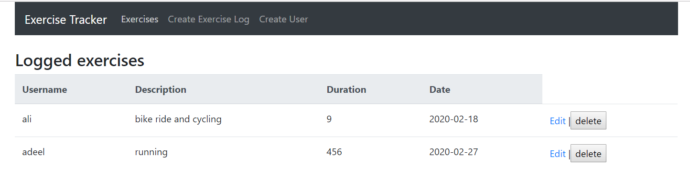
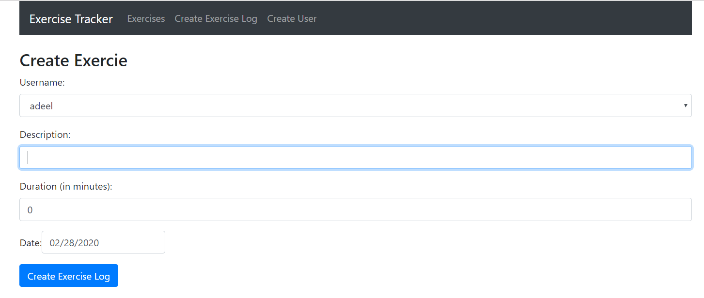
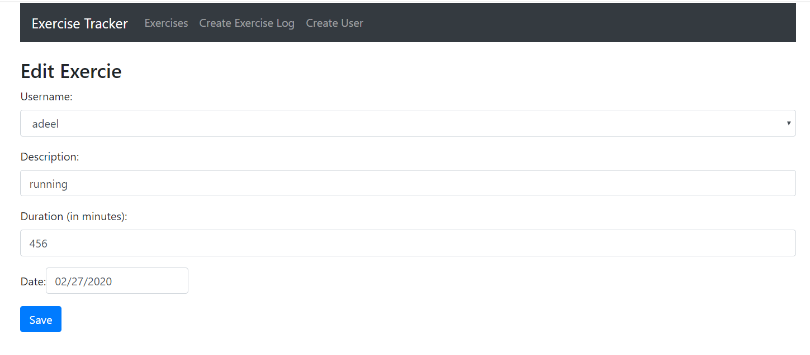

Created this app with express to connect to mongo DB and created models and routes for API'S. Used react as a front end. A User can be added through a form and exercises for specific user can be added with description,duration and date. Exercises are listed at home with CRUD functionalities.
Live on : https://fierce-reef-69249.herokuapp.com/
  
<b>Screenshots:</b> 

 

 

 

 
